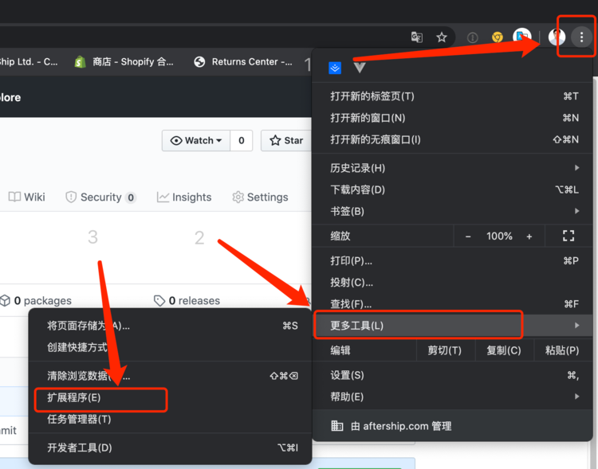
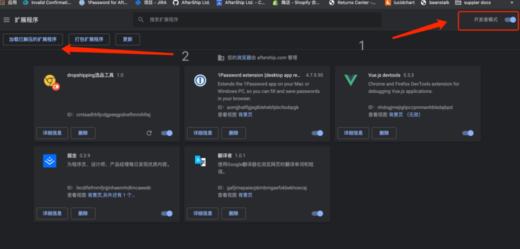

# dropshipping选品工具

## How to use
### install module
```
npm i
```


### dev mode
#### System dependent
Start the following system
1. platform.automizelyapi.com_suppliers   listen: 8080
2. product.automizelyapi.com_dropshipping listen: 8079

When you complete the above steps, run :
```
npm run dev
```
Now you can View plugins web view on：``` http://localhost:8081  ```


### Build test chrome plugins
If you want to build a plugins in test environment, run:
```
npm run test
```
1. Then you will get ``` dist ``` file in the same directory

2. Now you can View ``` chrome —— more tools —— extension  ``` to open ``` Develop mode ```

3. At last You can click ``` load unpacked extension ``` button to load ``` dist ``` file.


### build production mode
```
npm run build
```

## How to install as Chrome plugins 




